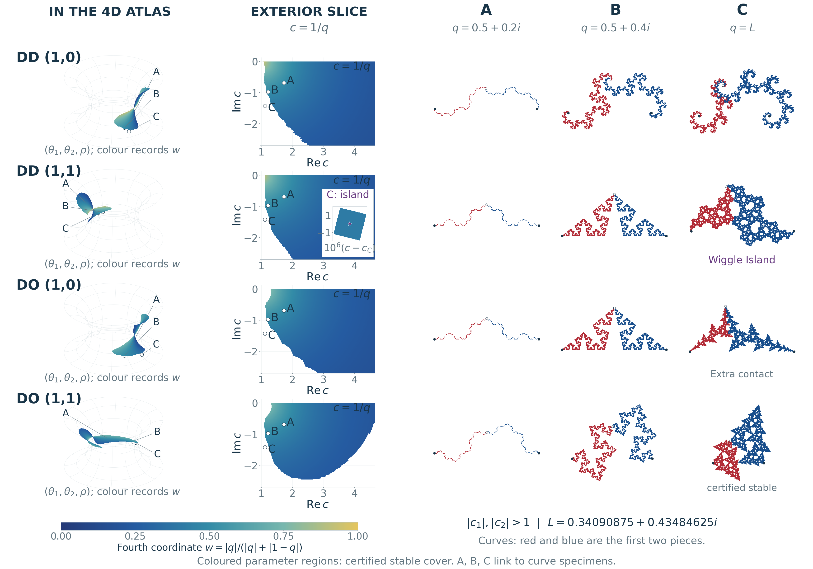

# Four-Dimensional Connectedness Loci

**Four-Dimensional Connectedness Loci and Structural Stability for Planar Binary Similarities**  
Bernat Espigulé · Universitat de Girona · Research companion v1.0.0

[Paper](publications/Four_Dimensional_Connectedness_Loci.pdf) · [BMD poster](publications/BMD2026_Poster.pdf) · [Live explorer](https://complextrees.com/4D/) · [Navigable atlas](https://complextrees.com/4D/atlas/) · [Downloads](https://github.com/espigule/ComplexTrees/releases/tag/v1.0.0)



## Research

A common framework for the DD, DO and OO orientation types of planar binary similarities, fixed-address contact fibres, exact phase families and stable zipper slices. Structural stability is defined relative to a specified parameter family: the full coding relation has no identifications beyond those forced throughout that family. This definition does not by itself assert ambient openness or perturbative dynamical stability.

The visual selection is **DD(1,0), DD(1,1), DO(1,0), DO(1,1)**, with three shared curve parameters per family. The reflected DD(0,1) presentation is omitted from the figures. Exterior coefficients have moduli greater than one; colour retains contraction weight in the three-dimensional projection.

**Publication status:** author-released preprint and research companion. No arXiv identifier or journal acceptance is asserted. The record will be updated after an announcement.

## Explore and reproduce

The established website hosts the [full explorer](https://complextrees.com/4D/), [six-point atlas](https://complextrees.com/4D/atlas/), [laboratory](https://complextrees.com/4D/lab/) and [mathematical guide](https://complextrees.com/4D/docs/).

`interactive/Four_Family_Stable_Atlas.html` is a self-contained offline four-family explorer. Download it and open it in a modern browser, or serve the repository using `python3 -m http.server 8000`. Its data and twelve curve examples are embedded.

```sh
(cd manuscript && pdflatex -interaction=nonstopmode -halt-on-error main.tex && pdflatex -interaction=nonstopmode -halt-on-error main.tex)
(cd poster && lualatex -interaction=nonstopmode -halt-on-error BMD2026_Connectedness_Atlas.tex && lualatex -interaction=nonstopmode -halt-on-error BMD2026_Connectedness_Atlas.tex)
python3 tools/check_release.py
```

`figure_sources/` contains generators and data, including the positive zipper-cell records and selected curve samples. `computation/` contains rational finite-exclusion certificates and an independent verifier. `verification/` contains finite algebra checks with their specified scope. All figures needed to compile the documents are included.

See [reproducibility](docs/REPRODUCIBILITY.md), [conventions](docs/CONVENTIONS.md), [rights](RIGHTS.md), and the [submission metadata](ARXIV_SUBMISSION.md). No font files are distributed.

## Cite

Use `CITATION.cff` or `citation.bib`. The citation does not invent an arXiv or journal identifier.

## Background and support

[Doctoral thesis](https://complextrees.com/research/thesis/): *Collinear Fractals and Connectedness Loci: Topology, Finite Capture, and Restricted Polynomial Roots*, Universitat de Girona, submitted 2026. Earlier complex-tree work and its relation to this atlas are documented in the paper.

Supported by the Spanish Ministerio de Ciencia, Innovación y Universidades through project **PID2023-146424NB-I00**.

Research and original interactive designs © Bernat Espigulé. Third-party notices remain applicable. No new open-source or Creative Commons licence is assigned by this release.
